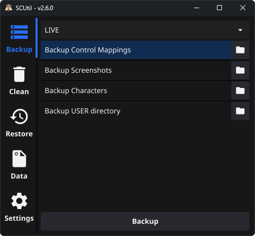

# SCUtil

Utility that does some useful things with your Star Citizen game data.



## 1. Features

### 1.1 Backup data

- **Backup control mapping**

  > This does a backup of your game's custom control mappings and stores it within the `BACKUPS` folder.
  > The backup location can be found in the root folder of SCUtil.

- **Backup screenshots**

  > This gives the user the ability to backup their Star Citizen screenshots within the `BACKUPS` folder.
  > The backup location can be found in the root folder of SCUtil.

- **Backup USER directory**

  > This will store a copy of the game's USER directory within the `BACKUPS` folder.
  > The backup location can be found in the root folder of SCUtil.

- **Backup Star Citizen characters**

  > This will store a copy of your Star Citizen character in the `BACKUP` folder.
  > The backup location can be found in the root folder of SCUtil.

### 1.2 Clear data

- **Clear all data except p4k**

  > Clears all data in the `Star Citizen` folder except the `Data.p4k` file. This is useful
  > to sometimes clear out odd issues that pop up.

- **Clear `USER` folder**

  > Clears the `USER` folder in the `Star Citizen` folder. This allows for the exclusion of control mappings. This
  > is useful to clear issues relating to old user files.

- **Clear Star Citizen AppData (Windows AppData)**

  > This clears out error logs that are typically found within Star Citizen's App Data which sometimes prevent
  > the game from starting. There is also the option to exlude the renderer settings so that the game does not default
  > back to DirectX.

- **Clear RSI Launcher AppData (Windows AppData)**

  > This clears out logs and cached items that are typically found within > the RSI Launcher's App Data which sometimes prevent the game from
  > starting.

### 1.3 Restore data

- **Restore control mappings**

  > Ability to restore previously backed up control mappings.

- **Restore characters (coming soon)**

  > Ability to restore previously backed up characters.

### 1.4 P4k data exploration

- **Reads all the filenames in the p4k data file**

  > This read all the filenames included wihtin the `Data.p4k` file and
  > writes it out to a file (`P4k_filenames.txt`). This is for the curious
  > individuals.

- **Search p4k filenames**

  > This features takes a phrase and searches for filenames within the
  > Data.p4k which contain the phrase. Also for the curious.

### 1.5 Game log mintoring

- **Tails active game log or read log backups**

> This feature allows for the tailing of the active game log or reading through backed up game logs. Additionally
> logs can be filtered based on events or based on a search field.

## 2. Running SCUtil

### 2.1. Executable

Simply download the release and place `SCUtil.exe` within any folder of your choosing (not in ProgramFiles). Set your game directory in settings. Any parent folder/drive to your Star Citizen installation can be selected as it will look for your installation. A `config.yaml` file should appear within the root directory of the `SCUtil.exe`. Below is a breakdown of the app's directory.

```txt
SomeDirectory
│   SCUtil.exe
│   config.yaml
└───BACKUPS
    └───Screenshots
    │   └───LIVE
    │   └───PTU
    └───ControlMappings
        └───LIVE
        └───PTU

```

### 2.2. Compile & Run SCUtil

On windows, with latest Golang version, simply compile the code using:

```bash
go build -o bin/SCUtil.exe main.go
```

With the executable, follow the instructions in section `2.1`.

> **NOTE** <br>
> Since version 2.0.0 of SCUtil, compilation will require the use of [Fyne](https://github.com/fyne-io/fyne) and a GCC compiler.
>
